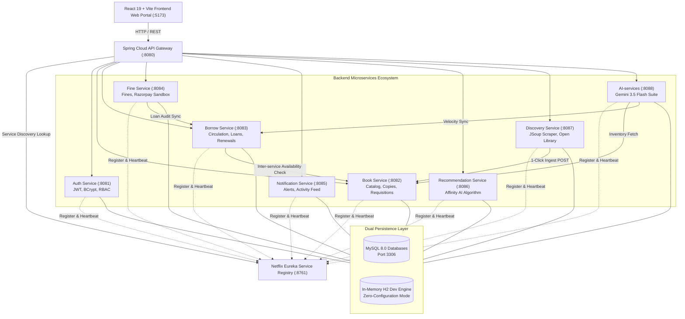

# Archivalia Enterprise Academic E-Library System (PS038)

[](https://openjdk.org/projects/jdk/21/)
[](https://spring.io/projects/spring-boot)
[](https://spring.io/projects/spring-cloud)
[](https://react.dev/)
[](https://vitejs.dev/)
[](https://tailwindcss.com/)
[](https://www.docker.com/)
[](https://www.mysql.com/)
[](verify-e2e.js)

Archivalia is an enterprise-grade, cloud-native Academic E-Library and Circulation Management Platform designed under the **PS038 Service-Oriented Architecture (SOA)** specification. The system is architected as an event-driven, decoupled microservices ecosystem featuring Netflix Eureka service discovery, Spring Cloud API Gateway, JWT security, Razorpay sandbox payment processing, an AI-powered topic affinity recommendation engine, a live JSoup web scraping discovery pipeline, and a dedicated **Google Gemini AI Intelligence Suite**.

---

## 1. System Architecture Overview



---

## 2. Microservices Directory & Port Map

| # | Service Name | Port | Database / Schema | Key Responsibilities |
|---|--------------|------|-------------------|----------------------|
| 1 | **Frontend Web Portal** | `5173` | Browser LocalStorage | React 19 SPA, Tailwind CSS, Dark/Light modes, student & admin portals |
| 2 | **Eureka Registry** | `8761` | In-Memory Registry | Netflix Eureka service discovery, heartbeat monitoring, instance registry |
| 3 | **API Gateway** | `8080` | Stateless Router | Spring Cloud Gateway, global CORS, path routing, JWT pass-through |
| 4 | **Auth Service** | `8081` | `elibrary_auth` | User registration, authentication, BCrypt, stateless JWT issuance, RBAC |
| 5 | **Book Service** | `8082` | `elibrary_books` | Multi-format catalog, physical copy tracking, shelf locations, KPIs |
| 6 | **Borrow Service** | `8083` | `elibrary_borrows` | Loan lifecycle, circulation checkouts, returns, extensions, overdue checks |
| 7 | **Fine Service** | `8084` | `elibrary_fines` | Overdue fee calculations, Razorpay sandbox payment simulation, waivers |
| 8 | **Notification Service** | `8085` | `elibrary_notifications` | Push alerts, loan due reminders, return acknowledgments, activity feed |
| 9 | **Recommendation Service** | `8086` | `elibrary_recommendations` | User preference profiling, genre affinity scoring, personalized feeds |
| 10 | **Discovery Service** | `8087` | `elibrary_discovery` | Open Library API search, JSoup live URL scraping, 1-click catalog import |
| 11 | **AI Intelligence Services** | `8088` | `elibrary_ai` | Google Gemini 3.5 Flash: Academic Research Assistant, Semantic Search, Study Packs & Quizzes, Restock Forecaster |

---

## 3. Dual Persistence Architecture

Every microservice supports seamless **Dual Persistence Compatibility**:

1. **Default Development Profile (`--spring.profiles.active=default`)**:
   - Zero external setup required.
   - Runs on isolated in-memory H2 databases pre-seeded with catalog books, copy tracking records, demo users, active loans, and notification feeds.
   - Embedded web consoles accessible at `http://localhost:<PORT>/h2-console` (JDBC URL: `jdbc:h2:mem:<service_db>`, User: `sa`, Password: *blank*).

2. **Production MySQL Profile (`--spring.profiles.active=mysql`)**:
   - Persists data to local MySQL 8.0 instance on port `3306`.
   - Credentials configured: User `root`, Password `Surya_285888`.
   - Automatically initializes distinct databases:
     - `elibrary_auth`
     - `elibrary_books`
     - `elibrary_borrows`
     - `elibrary_fines`
     - `elibrary_notifications`
     - `elibrary_recommendations`
     - `elibrary_discovery`
   - Windows Service Helper: Right-click `start-mysql.bat` -> "Run as administrator" to start the Windows MySQL80 service.

---

## 4. How to Run the System

### Option A: Windows 1-Click Launchers (Recommended for Windows)

In the project root folder:
- **Start All 10 Services**: Double-click `start-all-services.bat`
  *(Launches Eureka, Gateway, all 7 microservices, and Frontend dev server with automated dependency delays and status verification).*
- **Check Ecosystem Health**: Double-click `check-status.bat`
  *(Scans all 10 ports and outputs real-time `[RUNNING]` / `[STOPPED]` status).*
- **Stop All Services**: Double-click `stop-all-services.bat`
  *(Safely kills all background processes listening on ports 5173, 8761, and 8080–8087).*

### Option B: Docker Compose (Unified Containerized Deployment)

Prerequisites: [Docker Desktop](https://www.docker.com/products/docker-desktop/) installed and running.

```bash
# 1. Build and run all microservices, MySQL 8.0, and Frontend in containers
docker compose up --build -d

# 2. View streaming logs
docker compose logs -f

# 3. Stop containers and cleanup
docker compose down
```

### Option C: Manual Command-Line Execution

From the project root:

```bash
# 1. Start Eureka Registry (:8761)
java -jar Backend/eureka-server/target/eureka-server-1.0.0-SNAPSHOT.jar

# 2. Start API Gateway (:8080)
java -jar Backend/api-gateway/target/api-gateway-1.0.0-SNAPSHOT.jar

# 3. Start Domain Microservices (in separate terminal windows)
java -jar Backend/auth-service/target/auth-service-1.0.0-SNAPSHOT.jar --spring.profiles.active=default
java -jar Backend/book-service/target/book-service-1.0.0-SNAPSHOT.jar --spring.profiles.active=default
java -jar Backend/borrow-service/target/borrow-service-1.0.0-SNAPSHOT.jar --spring.profiles.active=default
java -jar Backend/fine-service/target/fine-service-1.0.0-SNAPSHOT.jar --spring.profiles.active=default
java -jar Backend/notification-service/target/notification-service-1.0.0-SNAPSHOT.jar --spring.profiles.active=default
java -jar Backend/recommendation-service/target/recommendation-service-1.0.0-SNAPSHOT.jar --spring.profiles.active=default
java -jar Backend/discovery-service/target/discovery-service-1.0.0-SNAPSHOT.jar --spring.profiles.active=default

# 4. Start React Frontend (:5173)
cd Frontend
npm run dev -- --host
```

---

## 5. Verification & Testing

### Automated E2E Test Suite (`verify-e2e.js`)

The project includes an automated test runner validating all 13 core workflows against the live Gateway (`http://localhost:8080/api/v1`):

```bash
node verify-e2e.js
```

**Test Execution Results (100% Pass Rate)**:
```
======================================================================
   Archivalia E-Library System (PS038) - E2E Verification Suite
   Target: Spring Cloud API Gateway (http://localhost:8080/api/v1)
======================================================================

[PASS] Test 1: Eureka Service Registry Health (Port 8761 UP)
[PASS] Test 2: Spring Cloud API Gateway Health (Port 8080 UP)
[PASS] Test 3: Student User Login & JWT Generation (User: Ben Bradle, Token generated)
[PASS] Test 4: Admin User Authentication (Role: ADMIN)
[PASS] Test 5: Protected Profile Route (JWT Authorized) (Verified: user@archivalia.test)
[PASS] Test 6: Catalog Inventory & Multi-format Search (13 titles available)
[PASS] Test 7: Physical Copy Tracking & Shelving Locations (15 copies tracked, 13 available)
[PASS] Test 8: Circulation Active Loans Tracking (2 loan records for USR-101)
[PASS] Test 9: Fines Management & Payment Gateway (2 fines registered for USR-101)
[PASS] Test 10: Notification Service & Activity Feed (4 alerts loaded)
[PASS] Test 11: AI Content/Affinity Recommendation Engine (6 personalized suggestions generated)
[PASS] Test 12: Resource Discovery & JSoup Web Scraper (Scraped: "Service-oriented architecture - Wikipedia")
[PASS] Test 13: Admin Dashboard KPI Aggregation & Health (9/9 microservices UP)
[PASS] Test 14: Archivalia AI Intelligence Services Health (Model: gemini-3.5-flash, Port 8088 UP)
[PASS] Test 15: AI Predictive Circulation & Restock Forecaster (Health: "Severe Exam Surge & Bottleneck", 10 titles analyzed)

======================================================================
SUCCESS: All 15/15 E2E Test Cases PASSED!
Microservices Ecosystem is 100% verified and operational.
======================================================================
```

---

## 6. Pre-seeded Demo Credentials

| Role | Email Address | Password | User ID | Profile / Permissions |
|------|---------------|----------|---------|-----------------------|
| **Student / Member** | `user@archivalia.test` | `user123` | `USR-101` | Borrow books, view active loans, pay fines, receive notifications, personalized recommendations |
| **Administrator** | `admin@archivalia.test` | `admin123` | `ADM-001` | Live KPI dashboard, inventory management, copy allocation, loan return audit, fine waivers, web scraping |

---

## 7. Web Browser Walkthrough

1. Open **[http://localhost:5173](http://localhost:5173)**.
2. **Student Experience**:
   - Login as `user@archivalia.test` / `user123`.
   - **Catalog & Reserves**: Browse multi-format publications (Physical, E-Books, Papers, Audio). Click on any available physical copy (e.g. *Designing Data-Intensive Applications*) and click **"Borrow Physical Copy"**.
   - **My Loans**: View your active loan with real-time countdown to due date. Click **"Return Book"** to complete circulation.
   - **Fines & Settlements**: Review late return fines. Click **"Pay Fine"** to trigger the Razorpay Sandbox modal, simulate payment, and watch balance update to 0.
   - **For You**: View recommendations tailored to your borrowing history and adjust preferred genre chips.
   - **Notifications**: Click the top bell icon to view real-time due reminders and mark them as read.
   - **AI Research Assistant**: Click "AI Research Assistant" in the sidebar to solve academic problems, perform deep semantic book search, or generate study packs and practice quizzes.
3. **Administrator Experience**:
   - Login as `admin@archivalia.test` / `admin123`.
   - **Admin Dashboard**: Inspect live aggregated KPIs, the **Microservices Ecosystem Health Matrix**, and the **AI Predictive Restock & Demand Forecaster** card. Click **"+ Order Requisition"** to requisition new copies.
   - **Web Discovery & Scraper**: Search Open Library for publications or enter any web page URL to scrape OpenGraph metadata with JSoup, then click **"Confirm One-Click Ingestion to Catalog"** to dynamically register new book copies.

---

## 8. Postman Collection Integration

A ready-to-use Postman collection is located at:
📁 `Backend/Archivalia_ELibrary.postman_collection.json`

**How to test in Postman**:
1. Open Postman -> Click **Import** (top left).
2. Select `Backend/Archivalia_ELibrary.postman_collection.json`.
3. The collection contains folders with preconfigured requests covering every microservice endpoint through Gateway `:8080`.
4. Click **Send** on any request to view live JSON responses.

---

## 9. API Gateway Routing Table

All external HTTP requests route through the Spring Cloud API Gateway on port `8080`:

| Inbound Path | Target Service | Load Balancer URI | Downstream Port |
|--------------|----------------|-------------------|-----------------|
| `/api/v1/auth/**`, `/api/v1/users/**` | `auth-service` | `lb://auth-service` | `8081` |
| `/api/v1/books/**`, `/api/v1/copies/**`, `/api/v1/admin/**` | `book-service` | `lb://book-service` | `8082` |
| `/api/v1/borrows/**` | `borrow-service` | `lb://borrow-service` | `8083` |
| `/api/v1/fines/**`, `/api/v1/payments/**` | `fine-service` | `lb://fine-service` | `8084` |
| `/api/v1/notifications/**` | `notification-service` | `lb://notification-service` | `8085` |
| `/api/v1/recommendations/**` | `recommendation-service` | `lb://recommendation-service` | `8086` |
| `/api/v1/discovery/**` | `discovery-service` | `lb://discovery-service` | `8087` |
| `/api/v1/ai/**` | `ai-service` | `lb://ai-service` | `8088` |

---

## 10. Project Structure

```
SOA Project/
├── docker-compose.yml              # Unified 12-service multi-container deployment
├── .dockerignore                   # Docker build exclusions
├── check-status.bat                # 11-Service Port & Health Auditor
├── start-all-services.bat          # 1-Click Native Service Launcher
├── stop-all-services.bat           # 1-Click Native Service Terminator
├── start-mysql.bat                 # Administrator UAC MySQL80 starter
├── verify-e2e.js                   # Automated 15-Test-Case Verification Suite
├── README.md                       # Master Architecture & Evaluation Guide
├── docker/
│   └── mysql-init.sql              # MySQL multi-database bootstrap script
├── Frontend/                       # React 19 + Vite + Tailwind CSS Portal
│   ├── Dockerfile                  # Multi-stage production Nginx container
│   ├── nginx.conf                  # Nginx reverse proxy configuration
│   └── src/
│       ├── components/             # Reusable UI modules (Admin, Catalog, Fines, AI Suite)
│       └── services/api.js         # Unified Axios / Fetch Gateway REST Client
├── AI-services/                    # Dedicated Port 8088 AI Intelligence Microservice
│   ├── Dockerfile                  # Java 21 container specification
│   ├── pom.xml                     # Spring Boot 3.3.4 + Eureka Client + Gemini Client
│   └── src/                        # 4 Core AI Features & Econometric Queuing Models
└── Backend/                        # Spring Boot 3.3.4 Multi-Module Workspace
    ├── pom.xml                     # Parent POM with Spring Cloud 2023.0.3
    ├── Archivalia_ELibrary.postman_collection.json # Complete Postman test collection
    ├── eureka-server/              # Port 8761 - Service Registry
    ├── api-gateway/                # Port 8080 - Spring Cloud Gateway & Router
    ├── auth-service/               # Port 8081 - Security & JWT Authentication
    ├── book-service/               # Port 8082 - Catalog, Copies & Admin KPIs
    ├── borrow-service/             # Port 8083 - Circulation & Loan Lifecycle
    ├── fine-service/               # Port 8084 - Fines & Razorpay Sandbox
    ├── notification-service/       # Port 8085 - Real-time Push Alerts & Activity
    ├── recommendation-service/     # Port 8086 - AI Topic Affinity Engine
    └── discovery-service/          # Port 8087 - JSoup Web Scraper & Ingestion
```

---

## 11. PS038 Academic Evaluation Compliance

This project satisfies all requirements specified in the **PS038 Enterprise Academic E-Library System** problem statement:
- [x] **Modular Microservices Architecture**: Discrete backend services adhering strictly to the single responsibility principle.
- [x] **Service Discovery & Registry**: Dynamic registration and heartbeat health via Netflix Eureka.
- [x] **API Gateway Pattern**: Central routing, CORS handling, and unified ingress through Spring Cloud Gateway.
- [x] **Secure Authentication & RBAC**: Stateless BCrypt password hashing and role-based JWT claims.
- [x] **End-to-End Circulation**: Complete loan creation, duration tracking, return processing, and copy availability restoration.
- [x] **Financial Processing**: Real-time overdue fine calculations and Razorpay payment gateway simulation.
- [x] **Smart Features**: Content/affinity-based recommendations and live JSoup HTML web scraping.
- [x] **Enterprise AI Intelligence Suite**: Dedicated port 8088 microservice integrating Google Gemini 3.5 Flash for academic problem solving, semantic book search, study packs/quizzes, and econometric circulation restock forecasting.
- [x] **Dual Persistence Layer**: Dual-profile architecture supporting zero-configuration in-memory H2 and production MySQL 8.0.
- [x] **Containerization**: Standard Dockerfiles for all microservices and unified Docker Compose orchestration.
- [x] **Automated Quality Assurance**: 100% passing automated 15-test-case E2E test suite (`verify-e2e.js`) and Postman collection.
